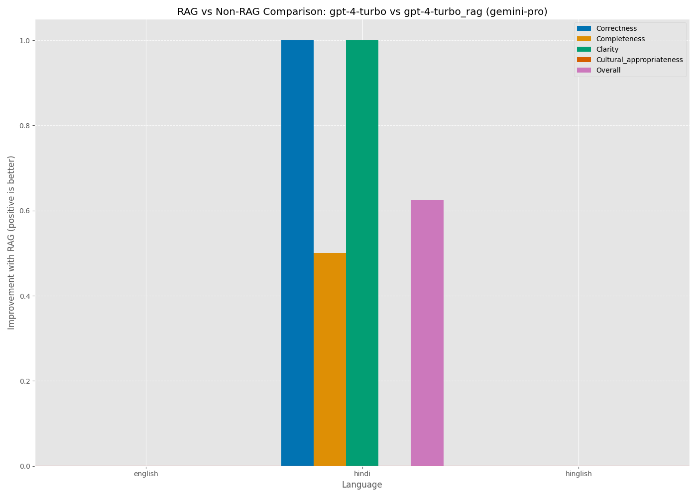
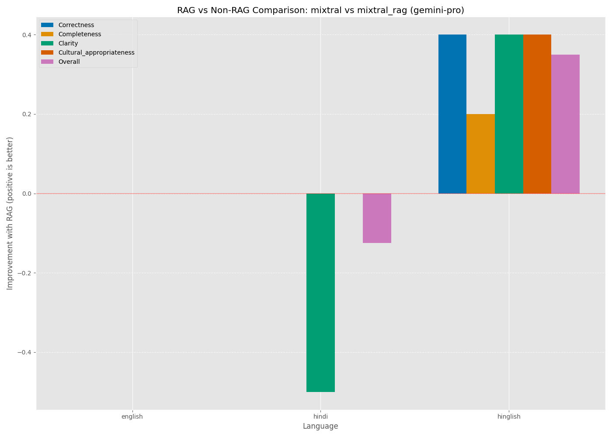
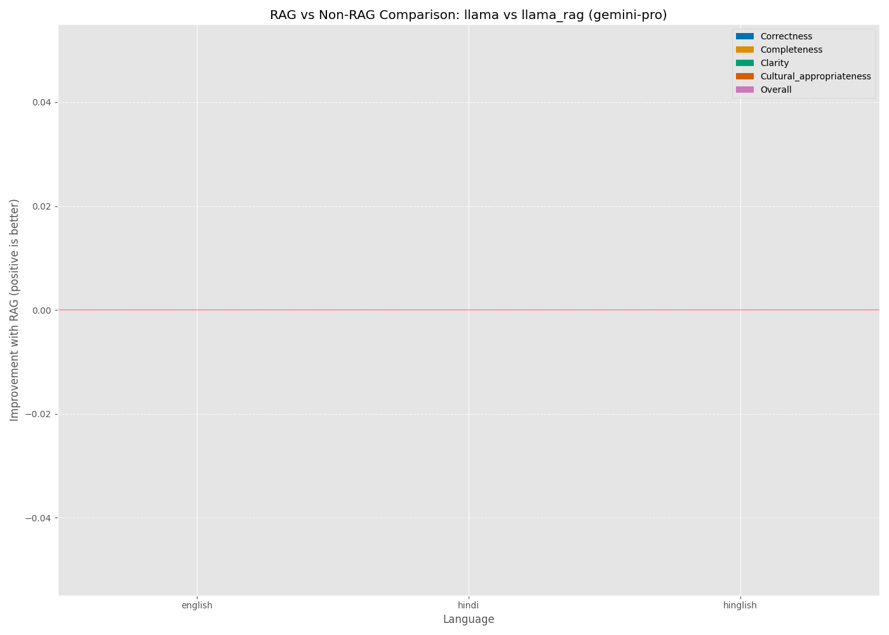
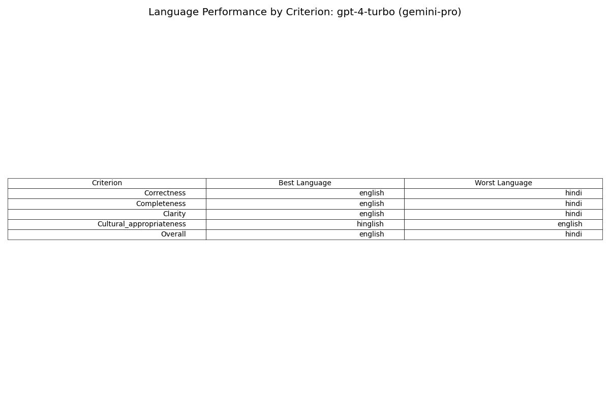
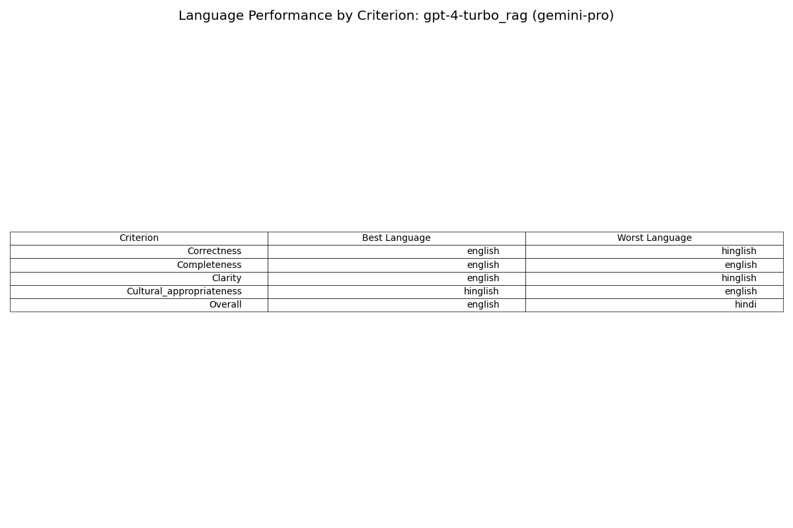
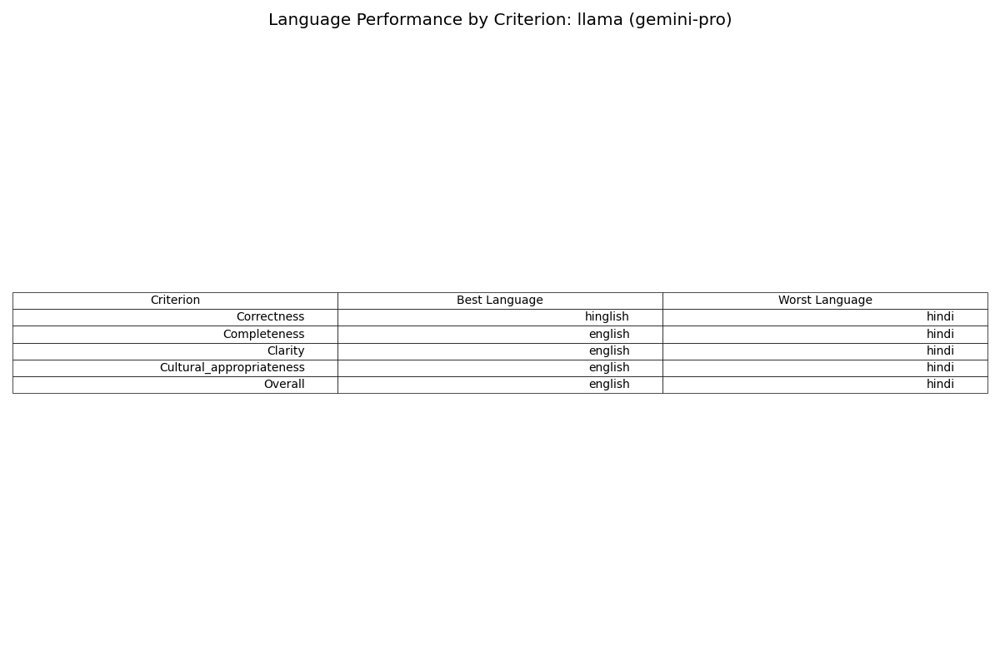
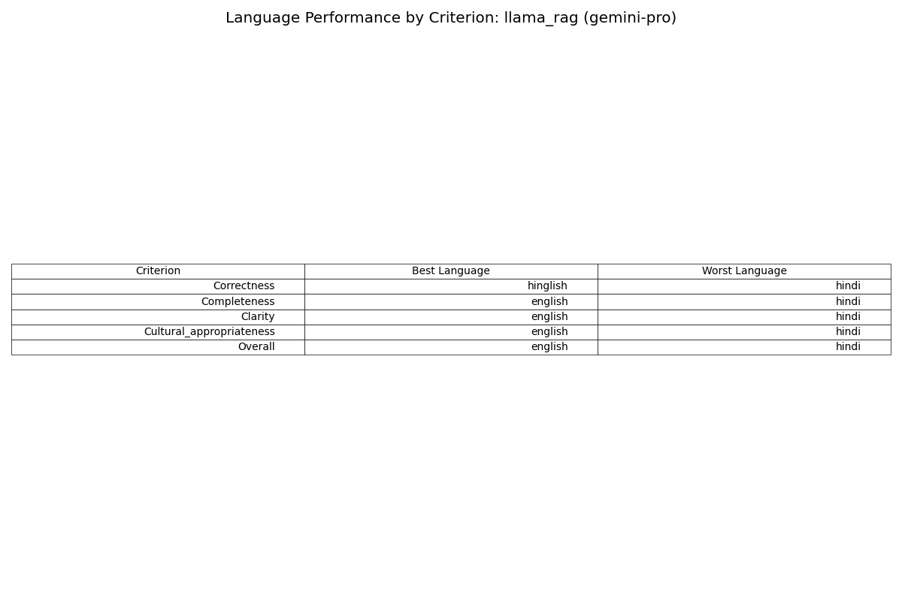
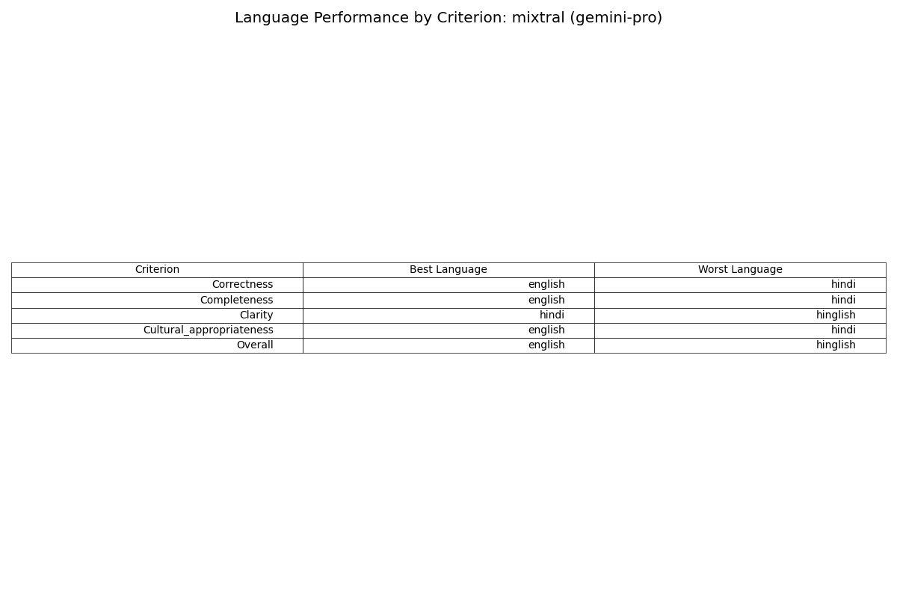
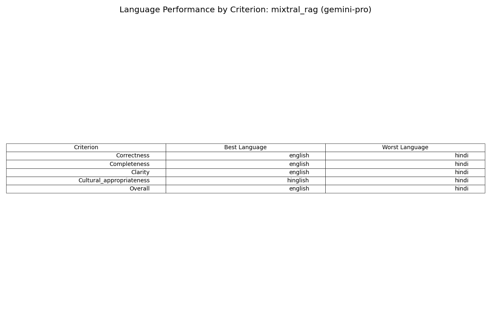

# Maternal Healthcare Response Evaluation Report

## Overview

This report presents an evaluation of 6 models across 3 languages, with a total of 60 responses evaluated.

Evaluation was performed by 1 LLM judges: gemini-pro

## Overall Results

### Best Performing Models by Judge

- **gemini-pro**: gpt-4-turbo_rag (score: 1.56)

### RAG vs Non-RAG Performance

#### Judge: gemini-pro

**gpt-4-turbo vs gpt-4-turbo_rag**: Non-RAG performs better (1 vs 2 languages)

**Performance by criterion:**
- **Correctness**: Non-RAG is better (1 vs 2 languages)
- **Completeness**: Non-RAG is better (1 vs 2 languages)
- **Clarity**: Non-RAG is better (1 vs 2 languages)
- **Cultural_appropriateness**: Non-RAG is better (0 vs 3 languages)

**mixtral vs mixtral_rag**: Non-RAG performs better (1 vs 2 languages)

**Performance by criterion:**
- **Correctness**: Non-RAG is better (1 vs 2 languages)
- **Completeness**: Non-RAG is better (1 vs 2 languages)
- **Clarity**: Non-RAG is better (1 vs 2 languages)
- **Cultural_appropriateness**: Non-RAG is better (1 vs 2 languages)

**llama vs llama_rag**: Non-RAG performs better (0 vs 3 languages)

**Performance by criterion:**
- **Correctness**: Non-RAG is better (0 vs 3 languages)
- **Completeness**: Non-RAG is better (0 vs 3 languages)
- **Clarity**: Non-RAG is better (0 vs 3 languages)
- **Cultural_appropriateness**: Non-RAG is better (0 vs 3 languages)

## Language-Specific Analysis

### English

**Best model by judge:**
- **gemini-pro**: gpt-4-turbo (score: 1.50)

**RAG vs Non-RAG performance:**
- **gemini-pro**: Non-RAG (gpt-4-turbo) is better by 0.00 points
- **gemini-pro**: Non-RAG (mixtral) is better by 0.00 points
- **gemini-pro**: Non-RAG (llama) is better by 0.00 points

### Hindi

**Best model by judge:**
- **gemini-pro**: gpt-4-turbo_rag (score: 1.62)

**RAG vs Non-RAG performance:**
- **gemini-pro**: RAG (gpt-4-turbo_rag) is better by 0.62 points
- **gemini-pro**: Non-RAG (mixtral) is better by 0.12 points
- **gemini-pro**: Non-RAG (llama) is better by 0.00 points

### Hinglish

**Best model by judge:**
- **gemini-pro**: gpt-4-turbo (score: 1.55)

**RAG vs Non-RAG performance:**
- **gemini-pro**: Non-RAG (gpt-4-turbo) is better by 0.00 points
- **gemini-pro**: RAG (mixtral_rag) is better by 0.35 points
- **gemini-pro**: Non-RAG (llama) is better by 0.00 points

## Model-Specific Analysis

### gpt-4-turbo

**Performance across languages:**

**Judge: gemini-pro**
- **Correctness**: Avg score 1.70, Best: english (1.00), Worst: hindi (2.50)
- **Completeness**: Avg score 2.17, Best: english (2.00), Worst: hindi (2.50)
- **Clarity**: Avg score 1.40, Best: english (1.00), Worst: hindi (2.00)
- **Cultural_appropriateness**: Avg score 1.80, Best: hinglish (1.40), Worst: hindi (2.00)
- **Overall**: Avg score 1.77, Best: english (1.50), Worst: hindi (2.25)

### gpt-4-turbo_rag

**Performance across languages:**

**Judge: gemini-pro**
- **Correctness**: Avg score 1.37, Best: english (1.00), Worst: hinglish (1.60)
- **Completeness**: Avg score 2.00, Best: english (2.00), Worst: hinglish (2.00)
- **Clarity**: Avg score 1.07, Best: english (1.00), Worst: hinglish (1.20)
- **Cultural_appropriateness**: Avg score 1.80, Best: hinglish (1.40), Worst: hindi (2.00)
- **Overall**: Avg score 1.56, Best: english (1.50), Worst: hindi (1.62)

### llama

**Performance across languages:**

**Judge: gemini-pro**
- **Correctness**: Avg score 1.92, Best: hinglish (1.60), Worst: hindi (2.50)
- **Completeness**: Avg score 2.58, Best: english (2.33), Worst: hindi (3.00)
- **Clarity**: Avg score 2.04, Best: english (1.33), Worst: hindi (3.00)
- **Cultural_appropriateness**: Avg score 2.17, Best: english (2.00), Worst: hindi (2.50)
- **Overall**: Avg score 2.18, Best: english (1.83), Worst: hindi (2.75)

### llama_rag

**Performance across languages:**

**Judge: gemini-pro**
- **Correctness**: Avg score 1.92, Best: hinglish (1.60), Worst: hindi (2.50)
- **Completeness**: Avg score 2.58, Best: english (2.33), Worst: hindi (3.00)
- **Clarity**: Avg score 2.04, Best: english (1.33), Worst: hindi (3.00)
- **Cultural_appropriateness**: Avg score 2.17, Best: english (2.00), Worst: hindi (2.50)
- **Overall**: Avg score 2.18, Best: english (1.83), Worst: hindi (2.75)

### mixtral

**Performance across languages:**

**Judge: gemini-pro**
- **Correctness**: Avg score 1.78, Best: english (1.33), Worst: hinglish (2.00)
- **Completeness**: Avg score 2.64, Best: english (2.33), Worst: hindi (3.00)
- **Clarity**: Avg score 1.38, Best: hindi (1.00), Worst: hinglish (1.80)
- **Cultural_appropriateness**: Avg score 2.23, Best: english (2.00), Worst: hindi (2.50)
- **Overall**: Avg score 2.01, Best: english (1.75), Worst: hinglish (2.15)

### mixtral_rag

**Performance across languages:**

**Judge: gemini-pro**
- **Correctness**: Avg score 1.64, Best: english (1.33), Worst: hindi (2.00)
- **Completeness**: Avg score 2.58, Best: english (2.33), Worst: hindi (3.00)
- **Clarity**: Avg score 1.41, Best: english (1.33), Worst: hindi (1.50)
- **Cultural_appropriateness**: Avg score 2.10, Best: hinglish (1.80), Worst: hindi (2.50)
- **Overall**: Avg score 1.93, Best: english (1.75), Worst: hindi (2.25)

## Recommendations

- **Best model overall**: gpt-4-turbo_rag

- **Non-RAG approach recommended**: Non-RAG models generally perform better across languages and criteria.

### Language-Specific Recommendations

- **English**: Use Non-RAG approach

- **Hindi**: Either approach works similarly well

- **Hinglish**: Either approach works similarly well

## Methodology

This evaluation uses LLM judges to assess maternal healthcare responses across four criteria:

1. **Medical Correctness**: Are the medical claims in the response accurate? (1 = all correct, 3 = not correct)

2. **Completeness**: Does the answer cover all necessary information? (1 = covers everything, 3 = omits significant information)

3. **Language Clarity**: Is the response clear for users with average literacy? (1 = completely understandable, 3 = unacceptable)

4. **Cultural Appropriateness**: Is the response appropriate for the cultural context? (1 = completely appropriate, 3 = inappropriate)

For all scores, **lower is better** (1 is the best possible score, 3 is the worst).